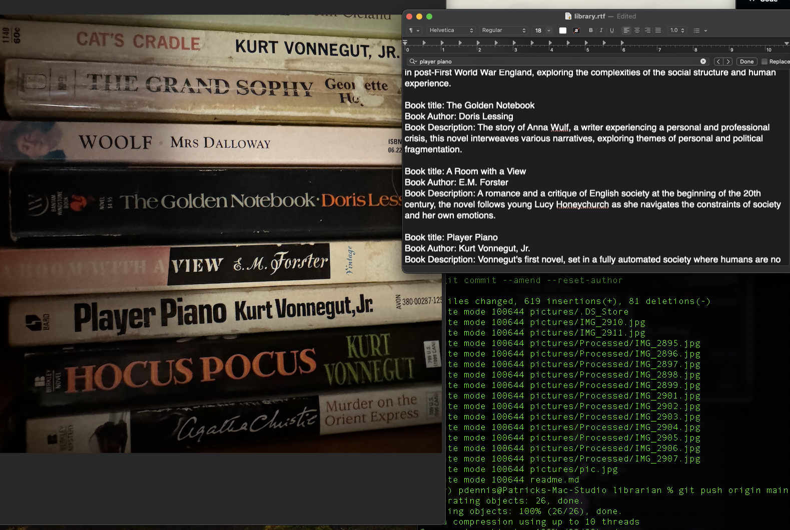

# Bookshelf to card catalogue

This was never intended to be public, and as of 5/12/24 has about 3 hours of work from idea to completion. So, needless to say, it's provided without warranty. Try to clean up the pictures, rotate the image so the book spines are horizontal and easily readable, and not too many books in frame at a time. 

This script is designed to process pictures of bookshelves, extracting information from book spines or covers, and using it to create a card catalogue. It utilizes the OpenAI API to convert images containing book covers into text descriptions. The text descriptions are then stored in a text file. It'll loop through as many images as you add to the pictures folder, and append all of the results to library.txt



## Prerequisites

- Python 3.x installed on your system.
- An active OpenAI API key. You can obtain one from the OpenAI website.

## Installation

1. Clone the repository or download the script.
2. Install the required Python packages using pip:

    ```
    pip install requests
    ```

## Usage

1. **API Key Setup**:
   
    Replace the `api_key` variable in the script with your actual OpenAI API key.

2. **Starting a Virtual Environment**:
   
    If you want to isolate dependencies, you can create and activate a virtual environment. Navigate to the directory containing the script in your terminal and execute the following commands:

    ```
    python3 -m venv venv
    source venv/bin/activate
    ```

3. **Running the Script**:
   
    Place the images you want to process in the  `pictures` directory.  Then, run the script using:

    ```
    python script.py
    ```

4. **Output**:
   
    The script will process each image in the `pictures` directory, extract text descriptions using the OpenAI API, and append the results to a file named `library.txt` in the same directory.

## Notes

- Ensure that the images you want to process are in either PNG, JPG, or JPEG format.
- Try to have the spines of the book oriented horizontally, to make it easier for GPT4 to read. Also, GPT4 can't process full rez pictures, so you'll have problems if you try to process too many pictures at once. I try to limit to 10-15 books per image tops.
- The extracted text descriptions will be added to `library.txt` with a header indicating the analysis for each image.
- The results will not be perfect

